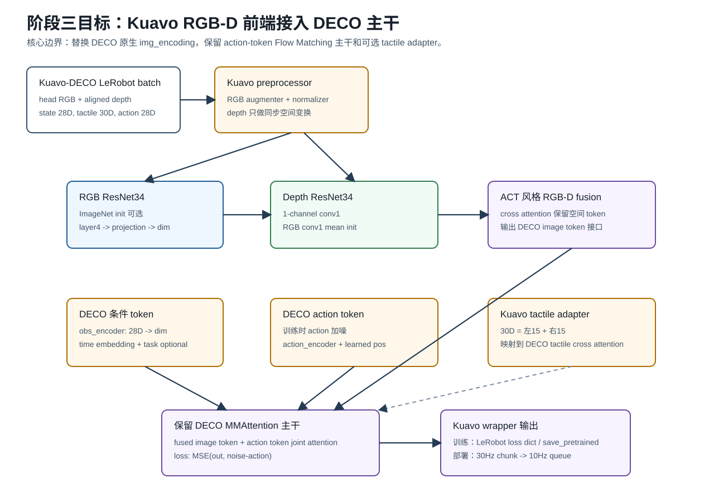
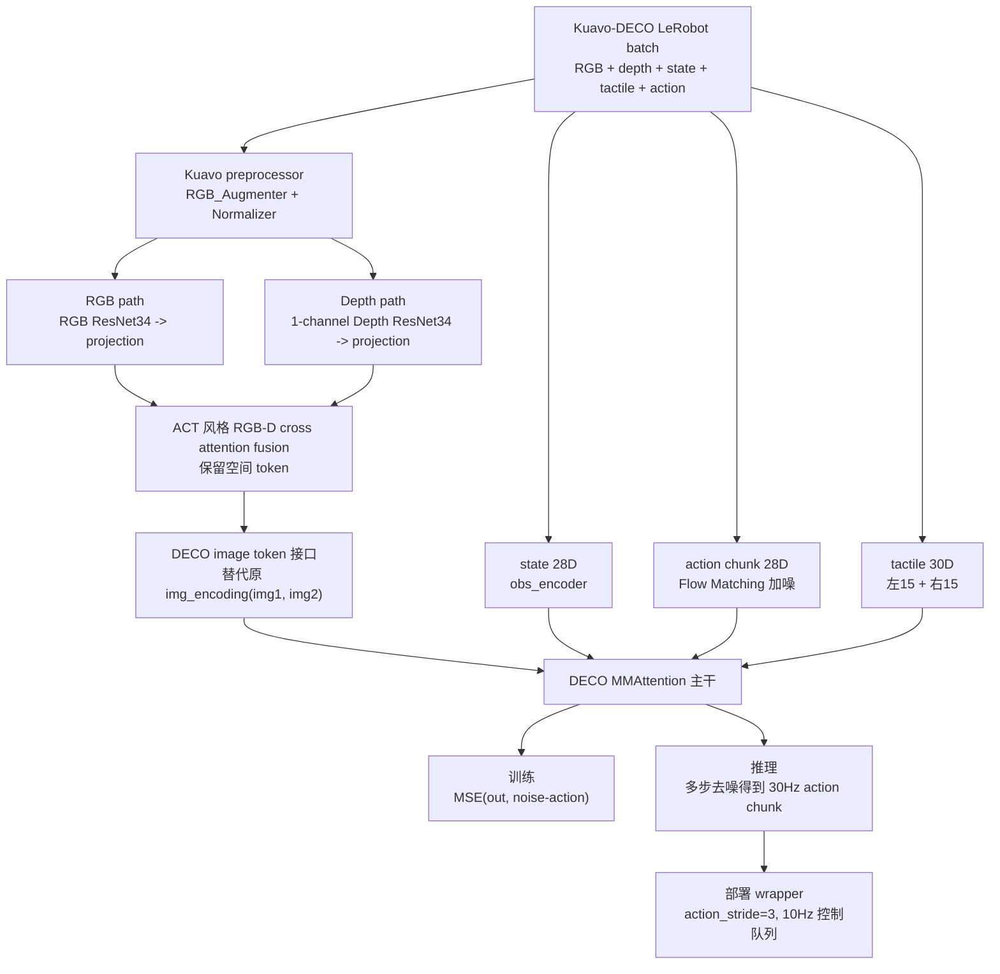

# DECO 与 Kuavo ACT 对比及第三阶段流程

> 生成日期：2026-05-14  
> 用途：在进入 Kuavo-DECO 第三阶段模型适配前，先静态梳理 DECO 原生流程、Kuavo ACT RGB-D wrapper 流程，以及第三阶段需要复用和替换的边界。  
> 约束：本文只基于源码静态阅读，不代表已经运行训练、forward 或部署验证。

---

## 1. DECO 与 ACT 的关键差异

| 维度        | DECO 原生                                     | Kuavo ACT RGB-D wrapper        | 第三阶段启示                          |
| ----------- | --------------------------------------------- | ------------------------------ | ------------------------------------- |
| 数据格式    | 自定义 episode 目录                           | LeRobot dataset                | DECO wrapper 应接 LeRobot batch       |
| 视觉输入    | 双 RGB                                        | RGB + depth                    | Kuavo-DECO 应用 RGB-D 替代双 RGB      |
| ResNet 数量 | 1 个共享 ResNet34                             | RGB ResNet + depth ResNet      | 第三阶段新增 depth backbone           |
| depth 支持  | 无                                            | 有，1-channel depth ResNet     | 借鉴 ACT depth conv1 初始化           |
| 图像增强    | Resize/Letterbox + ColorJitter + GaussianBlur | Kuavo RGB_Augmenter            | 复用 Kuavo RGB_Augmenter              |
| depth 增强  | 无                                            | 不做颜色类增强，仅同步空间变换 | 阶段三必须保留 depth 物理语义         |
| 视觉 token  | 双 RGB spatial token                          | RGB-D fused spatial token      | 融合后接 DECO image token 位置        |
| 动作建模    | Flow Matching                                 | VAE + action query regression  | DECO 主干不应改成 ACT loss            |
| loss        | MSE(out, noise-action)                        | L1 + KL                        | 第三阶段保留 DECO loss                |
| 触觉        | 1062+1062 Inspire tactile                     | ACT wrapper 当前不处理 tactile | Kuavo-DECO 需改成 30D tactile         |
| 保存方式    | `.pth` 为主                                   | `save_pretrained` 体系         | 阶段四应统一到 Kuavo/LeRobot 保存方式 |

---

## 2. 第三阶段目标流程





第三阶段不应该把 DECO 整体重写成 ACT。更准确的目标是：

```text
用 ACT 的 RGB-D 前端思想，替换 DECO 原生双 RGB img_encoding。
保留 DECO 的 action token、MMAttention、Flow Matching loss、denoising loop。
```

### 2.1 应该替换的部分

需要替换或新增：

- `img_encoding(img1, img2)` 的输入假设。
- 新增 RGB backbone 和 depth backbone 的 RGB-D 前端。
- 新增 ACT 风格 RGB-depth cross attention fusion。
- 新增 depth 1-channel 输入适配。
- 新增 LeRobot batch 到 DECO 参数的 wrapper 读取逻辑。
- 触觉分支从原生 `1062 + 1062` 改为 Kuavo `15 + 15`。

### 2.2 应该保留的部分

应尽量保留：

- `action_encoder`
- `action_embedd`
- `MMAttention`
- `linear` action head
- `add_noise`
- `F.mse_loss(out, noise - action)` 训练目标
- 推理阶段的 Flow Matching denoising loop
- `plugin=True` / `PI_Adapter` 的低秩 tactile adapter 思路

### 2.3 第三阶段最容易出错的点

1. 不要把 `chunk_size` 理解成视觉帧数。它是 action chunk 长度。
2. 不要把 `inf_step` 理解成机器人控制频率。它是 Flow Matching 推理去噪步数。
3. 不要把 Kuavo 单目 RGB 切成左右半图伪装 DECO 双目。当前计划已经放弃这条路线。
4. 不要把 depth 当作 RGB 做 ColorJitter、Hue、Saturation 等增强。
5. 不要把 RGB-D feature 过早 global pooling 成一个向量。DECO 主干需要空间 token。
6. 不要直接严格加载 DECO 原始完整权重到改造后的 RGB-D 模型。视觉前端和触觉维度都会改变。
7. 不要修改 `third_party/lerobot/`。Kuavo 适配应放在 wrapper 或 `lerobot_patches/` 中。

---

## 3. 面向实现的结论

第三阶段的合理实现边界可以概括为：

```text
输入：
  observation.images.head_cam_h: RGB, Bx3xHxW
  observation.depth_h: depth, Bx1xHxW 或由 3-channel depth image 还原为 1-channel
  observation.state: Bx28
  observation.tactile: Bx30
  action: Bxchunk_sizex28

视觉前端：
  RGB -> ResNet34 -> projection -> RGB spatial tokens
  Depth -> 1-channel ResNet34 -> projection -> depth spatial tokens
  RGB-depth cross attention -> fused spatial tokens

DECO 主干：
  fused spatial tokens 替代原 img1/img2 tokens
  action token 按 Flow Matching 加噪
  state/time/tactile 作为条件
  MMAttention 输出 noise - action

训练：
  loss = MSE(out, noise - action)

部署：
  denoising 得到 30Hz 语义 action chunk
  action_stride = dataset_hz // control_hz = 3
  10Hz action queue 输出单步 28D action
```

这也是后续编写 `configs/policy/deco_config.yaml`、`DECOConfigWrapper`、`DECOPolicyWrapper.forward` 和 `DECOPolicyWrapper.select_action` 时应遵守的主线。
