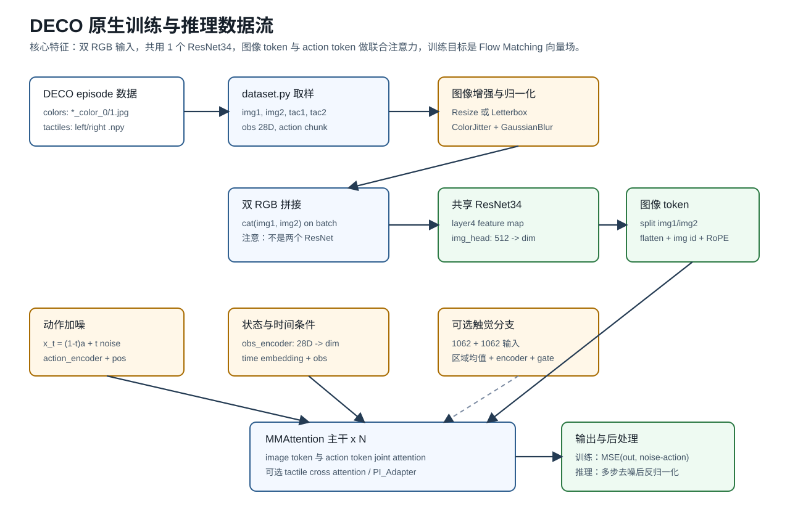
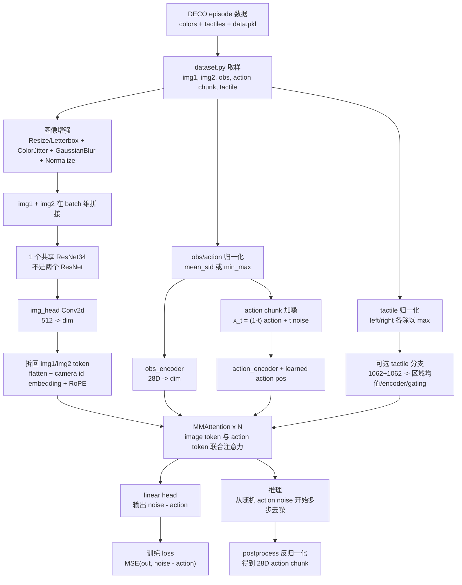

# DECO 原生流程梳理

> 生成日期：2026-05-14  
> 用途：在进入 Kuavo-DECO 第三阶段模型适配前，先静态梳理 DECO 原生流程、Kuavo ACT RGB-D wrapper 流程，以及第三阶段需要复用和替换的边界。  
> 约束：本文只基于源码静态阅读，不代表已经运行训练、forward 或部署验证。

---

## 1. 静态阅读范围

本次主要参考以下文件：

- `third_party/deco/dataset.py`：DECO 原生数据读取、双 RGB、触觉、状态和 action chunk 拼接。
- `third_party/deco/train.py`：DECO 原生训练入口、图像增强、DataLoader、checkpoint 保存。
- `third_party/deco/models/deco/deco.py`：DECO 主模型、`img_encoding`、Flow Matching、MMAttention、PI_Adapter。
- `third_party/deco/models/deco/img_encoder.py`：DECO 自带 ResNet34。
- `third_party/deco/models/deco/train_one_epoch.py`：DECO 训练 loss 与验证逻辑。
- `third_party/deco/inference.py`：DECO 推理预处理、反归一化和 action chunk 输出。

---

## 2. DECO 原生整体流程





### 2.1 数据进入模型前发生了什么

DECO 原生数据目录不是 LeRobot 格式，而是每个 episode 单独组织：

```text
episode_xxx/
  colors/
    000_color_0.jpg
    000_color_1.jpg
  tactiles/
    000_left_ee_tactile.npy
    000_right_ee_tactile.npy
  data.pkl
```

`dataset.py` 的 `__getitem__` 每次以一帧图像为起点，构造：

- `img1`：`*_color_0.jpg`
- `img2`：`*_color_1.jpg`
- `tac1` / `tac2`：左右手触觉，各自原生 1062 维
- `obs_state`：`left_obs + right_obs + head_obs` 拼成 28 维
- `action`：从当前帧开始截取 `chunk_size` 个未来动作，拼成 `(chunk_size, 28)`
- `mask`：标记 action chunk 中哪些是真实帧，哪些是末尾 padding
- `task_idx`：可选任务条件编号

关键点：DECO 原生假设输入是两个 RGB 视角，不包含 depth。Kuavo 目前已经确认头部 RGB 不是可切分双目，因此第三阶段不能继续沿用这个假设。

### 2.2 DECO 原生图像增强

DECO 原生训练入口在 `train.py` 中构造 `train_transform`：

- `Resize(img_size)` 或 `letterbox(img_size)`
- `RandomApply(ColorJitter, p=0.5)`
- `RandomApply(GaussianBlur, p=0.5)`
- `ToImage`
- `ToDtype(torch.float32, scale=True)`
- `Normalize(img_mean, img_std)`

这里的增强是直接作用在 `img1` 和 `img2` 上。源码通过固定随机种子的方式，尽量让两张图使用同一组随机增强参数。

#### 2.2.1 Resize / Letterbox：到底是下采样还是裁切？
目标：确实是为了得到一个标准的、比如 256 x 256 的正方形像素块，因为神经网络在处理 Batch 数据时，要求所有图片的尺寸必须严格一致（矩阵才能堆叠起来）。

它具体是怎么做的？ 它绝对没有裁切 (Crop)。在机器人视觉中，裁切是非常危险的操作，因为可能会把画面边缘的关键物体（比如即将抓取的杯子）给切没掉。 letterbox 的具体操作是等比例缩放 (Scale) + 补边 (Padding)：
- 找长边：假设原图是宽屏的 640 x 480 (宽x高)。它发现长边是 640。
- 等比例缩放 (通常是下采样)：为了把长边塞进 256，缩放比例是 256 / 640 = 0.4。于是整张图被等比例缩小成了 256 x 192。此时画面没有任何变形或信息丢失。
- 补边 (Padding)：现在的图高只有 192，距离目标 256 还差 64 个像素。letterbox 会在这张图的上方和下方，各贴上一条宽 32 像素的灰色胶带（像素值为 128）。
- 最终结果：得到了一张完美的 256 x 256 图像，中间是原始画面，上下是灰边。灰色 (128) 是一种“中性”颜色，对神经网络的刺激最小，不会产生误导特征。

#### 2.2.2 ColorJitter & GaussianBlur
这两个都是为了模拟机器人在真实物理世界中可能遇到的“恶劣情况”，也就是让模型“见多识广”。

- ColorJitter (颜色抖动)：
  - 操作：它会随机改变图片的 亮度 (Brightness)、对比度 (Contrast) 和 饱和度 (Saturation)。代码里写的是 (0.7, 1.3)，意思是它会随机生成一个 0.7 到 1.3 之间的系数乘上去。
  - 物理意义：模拟现实中光线的变化。比如今天实验室开灯了（亮度 1.2），明天阴天（亮度 0.8），或者摄像头参数变了导致颜色偏淡（饱和度 0.8）。加了这个，模型就不会死记硬背某种特定的颜色，而是去学习物体的形状和轮廓。
- GaussianBlur (高斯模糊)：
  - 操作：使用一个高斯核（本质上是一个权重矩阵，中心权重高，边缘权重低）在图片上滑动，把每个像素和它周围的像素做加权平均。周围的像素混进来了，图片就变糊了。
  - 物理意义：模拟机器人在快速运动时的运动模糊，或者摄像头偶尔对焦不准的情况。如果模型连稍微模糊的图都能认出来，那在机器人实际高速运动时，控制指令就不会因为一帧模糊而崩溃。

ColorJitter & GaussianBlur 的概率处理：
- 为什么用概率处理？ 这是深度学习数据增强中非常经典且有效的做法。如果你对 每一张图 都做颜色扭曲和高斯模糊，模型可能会过度适应这种“脏数据”，反而丧失了对清晰、正常光照环境的特征提取能力。
- 好处：p=0.5 意味着在每个 Training Epoch 喂图给模型时，某一张图有 50% 的几率被加上光照/颜色干扰，50% 几率加上模糊干扰。这样一来，同一个 Episode 的数据在不同的 Epoch 中会被模型看到“清晰版”、“模糊版”、“偏暗版”等多种形态，极大提高了模型在真实物理世界部署时的泛化能力和鲁棒性

#### 2.2.3 Normalize 归一化：
公式就是 $(x - mean) / std $。

图片怎么做归一化？其实图片在计算机眼里就是一堆数字。 一张 256x256 的彩色图，就是一个 3 x 256 x 256 的立体数字矩阵（3代表R, G, B三个颜色通道）。

1. 转为浮点数：原本像素是 0~255 的整数，框架会先除以 255，把它们变成 [0.0, 1.0] 之间的小数（比如纯红的 R 通道是 1.0，黑是 0.0）。
2. 通道独立计算：Normalize 会提供 3 个 mean 和 3 个 std（对应 R, G, B）。
   - 比如对所有 R 通道的像素点（共 256*256 个数），每一个数都会执行：$R_新 = (R_旧 - mean_R) / std_R$
   - 对 G 和 B 通道也是同理。 计算完后，原本 [0.0, 1.0] 的像素值，通常会被拉伸到大约 [-2.0, 2.0] 附近，且正负交替。

如果不做归一化会怎样？ 这是深度学习的“命门”之一。如果不做归一化（即像素值全是 0 到 255 的大整数，或者全是在 0~1 的正数）：

- 梯度更新极其困难（甚至爆炸）：输入数字太大，经过网络层层相乘后，数字会大到溢出（NaN），模型直接崩溃。
- 寻优路径呈“Z”字形（收敛极慢）：因为如果没有归一化，各个通道的数据分布不均匀（比如红色通道普遍偏高）。在多维空间里，Loss 的等高线会变成极度扁平的椭圆形。优化器（Adam/SGD）在下山寻找最低点时，会在峡谷两壁来回震荡，走非常曲折的“Z”字形路径，训练几天几夜都收敛不了。
- 做了归一化后：数据被强制拉成了以 0 为中心、方差为 1 的标准正态分布。Loss 的等高线变成了正圆形，优化器可以笔直地、快速地冲向最低点，大大加快了训练速度，且模型更容易找到全局最优解。

#### 2.2.4 batch 维拼接

1. 原始维度代表什么？
假设我们在训练时，设定的 Batch Size = 8（也就是一次喂给模型 8 个时间步的数据）。 那么 img1（左相机）和 img2（右相机）这两个变量，在 PyTorch 里的维度（Shape）都是： [8, 3, 256, 256]

这个四维矩阵（Tensor 张量）分别代表：

- 8 (Batch 维, dim=0)：一共有 8 张独立的图片。
- 3 (Channel 维, dim=1)：每张图片有 R、G、B 三个颜色通道。
- 256 (Height 维, dim=2)：每张图片的高度。
- 256 (Width 维, dim=3)：每张图片的宽度。
- 
2. 在 Batch 维 (dim=0) 拼接是什么意思？
img = torch.cat([img1, img2], dim=0) 这行代码的意思是：“顺着第 0 个维度（也就是图片的数量这一维）把两摞图片摞在一起”。

这是一个非常聪明且工程化的设计，目的只有两个：骗过 ResNet 和 压榨 GPU 算力。

假设 1：如果在宽度上拼接（左右拼成一张宽图）
- 维度变成 [8, 3, 256, 512]。
- 缺点：如果拼成一张长图，ResNet 的卷积核（滑窗）滑到正中间的拼接缝隙时，会强行把左相机的右边缘和右相机的左边缘做卷积。但这在物理世界上是毫无意义的（这两个相机可能一个看天一个看地）。这会给模型引入“假特征”。
  
假设 2：如果在通道上拼接（变成 6 通道图片）
- 维度变成 [8, 6, 256, 256]。
- 缺点：标准的 ResNet34 第一层卷积只接受 3 通道（RGB）的输入。如果你喂给它 6 通道，你就必须修改网络结构，并且无法使用 ImageNet 上预训练的绝佳视觉权重了（只能从头训练，非常耗时且效果差）。

现在的做法：在 Batch 维拼接
- 维度变成 [16, 3, 256, 256]。
- 优点：对于 ResNet34 来说，它根本不知道这 16 张图是来自左相机还是右相机。它只知道：“哦，你给了我 16 张标准的、完全独立的 3x256x256 的 RGB 图片。”
结果：
  - 完美调用了官方标准的 ResNet34 结构。
  - 完美加载了 ImageNet 的预训练权重。
  - 让 GPU 在一次 Forward (前向传播) 运算中，并行处理完左右相机的全部图片，计算效率最高。

处理完之后，作者再切一刀（通过 feat.chunk(2, dim=0)），把前 8 个特征和后 8 个特征分开，重新加上“左眼”和“右眼”的标签（Camera ID embedding），送给后续的 Transformer。这个设计非常优雅。


#### 2.2.5 Flatten 
- 现在的特征图还是一个二维的立体矩阵（比如宽 8、高 8、厚 dim），形状是 [Batch, dim, 8, 8]。但 Transformer 这个模型，最早是用来做自然语言处理（比如翻译文本）的，它看不懂二维图片，它只能读懂一维的“句子”。
- 物理意义：把这 8x8 = 64 个小方块，像拉面条一样拉直，变成一个长度为 64 的一维序列。形状变成了 [Batch, 64, dim]。
- 现在，这 64 个小方块，就像是一句话里的 64 个单词 (Tokens)。
- 每个单词蕴含着图片某个小区域的高阶语义（比如“这里有个杯子把手”），而单词的厚度就是我们上一步说的 dim。
- 
#### 2.2.6 RoPE (旋转位置编码, Rotary Position Embedding)
- 为什么需要：当你把二维的图片“拉直”成一维的句子后，空间几何关系就丢失了！模型怎么知道第 1 个单词（左上角）和第 9 个单词（第二行第一个）在物理上其实是挨着的？
- 在干什么：RoPE 是目前大模型界（比如 LLaMA、Qwen）最火的位置编码技术。在图片拉直之前，它根据每个方块原本在图上的 (X, Y) 坐标，对这 64 个向量进行了一次复杂的“角度旋转”计算。
- 物理意义：它给每个 Token 注入了绝对和相对的方位感。通过 RoPE，Transformer 就能在茫茫多的单词中瞬间明白：“哦，A 方块在 B 方块的正下方 5 厘米处”。这对机器人抓取时判断距离和方位至关重要。
- 
#### 2.2.7 Camera ID embedding (相机 ID 标签)
- 为什么需要：左右两张图被展平成两句“话”之后，我们马上要把它们首尾相连，拼成一句有 128 个单词的超级长句，送给 Transformer。但 Transformer 怎么知道前 64 个词是左眼看到的，后 64 个词是右眼看到的呢？
- 在干什么：
    - 系统为左眼生成了一个专属的“工牌”（一个长度为 dim 的向量，代表 ID=0）。
    - 为右眼生成了另一个专属的“工牌”（代表 ID=1）。
    - 把左工牌硬加（相加）到前 64 个单词上；把右工牌加到后 64 个单词上。
- 物理意义：明确区分视角来源。哪怕左右眼同时看到了同一个红色的苹果，加上 ID 标签后，模型就能区分：“前一半特征描述的是苹果的左侧面，后一半描述的是苹果的右侧面”，从而在大脑里构建出立体的 3D 概念。


---

与 Kuavo 现有增强体系相比，DECO 原生增强比较简单：
- 有 `ColorJitter`
- 有 `GaussianBlur`
- 没有 `SharpnessJitter`
- 没有 `RandomMask`
- 没有 `RandomBorderCutout`
- 没有 `GaussianNoise`
- 没有 `GammaCorrection`
- 没有 RGB-depth 同步空间变换，因为原生没有 depth

### 2.3 DECO 用几个 ResNet，怎么拼接

DECO 原生只初始化一个 `ResNet34`：

```text
self.img_encoder = ResNet34()
```

`img_encoding(img1, img2)` 的实际逻辑是：

```text
img = cat([img1, img2], dim=0)
feat = shared_resnet34(img)
feat = img_head(feat)
feat1, feat2 = feat.chunk(2, dim=0)
feat1 = flatten spatial tokens
feat2 = flatten spatial tokens
feat = cat([feat1, feat2], dim=1)
feat = feat + camera_id_embedding
```

所以它不是两个 ResNet，也不是两个独立视觉编码器，而是 **双 RGB 共享一个 ResNet34**。这样做的含义是两个相机视角被看作同一视觉模态的两个视角，参数共享可以减少模型规模，也让两个视角的特征空间一致。

### 2.4 图像 token 怎么进主干

DECO 把 ResNet 输出的 feature map 展平成空间 token：

```text
feat1: (B, dim, H', W') -> (B, H'*W', dim)
feat2: (B, dim, H', W') -> (B, H'*W', dim)
feat:  (B, 2*H'*W', dim)
```

同时它会给两个图像来源加 camera id embedding，并给每个空间 token 加 RoPE 旋转位置编码。

然后，DECO 不是先把图像压成一个全局向量，而是保留空间 token，并与 action token 一起进入 `MMAttention`：

```text
image token + action token -> joint attention
```

这点对第三阶段很重要：Kuavo RGB-D 前端最好也输出空间 token，而不是过早做 global average pooling。

### 2.5 DECO 主干和训练目标

DECO 的训练是 Flow Matching 风格。训练时：

1. 随机采样 `t`。
2. 对真实 action chunk 加噪：

```text
x_t = (1 - t) * action + t * noise
```

3. 模型输入加噪后的 action token，以及 image/state/tactile 条件。
4. 模型输出目标向量场：

```text
target = noise - action
```

5. loss：

```text
F.mse_loss(out, noise - action)
```

推理时，DECO 从随机 action noise 开始，按 `inf_step` 做多步去噪，最后输出 `(chunk_size, 28)` 的 action chunk。

### 2.6 训练结果后怎么操作

DECO 原生训练会保存：

- `best.pth`：验证 loss 更优时保存的模型权重。
- `epoch_x_loss_y.pth`：按 `save_period` 保存的周期性权重。
- `last_weights.pth`：包含 model、optimizer、lr_scheduler、epoch、scaler 的续训 checkpoint。
- `result.txt`：训练和验证日志。
- `loss/train_loss.png`、`loss/val_loss.png`：loss 曲线。

部署时，`inference.py` 负责：

1. 对实时图像做与测试一致的 resize/normalize。
2. 对 obs 和 tactile 做与训练一致的归一化。
3. 调用模型 `training=False` 得到 action chunk。
4. 对 action 做反归一化。
5. 返回真实量纲下的 28 维动作序列。

这套保存和部署方式不是 LeRobot `save_pretrained` 体系。Kuavo 第四阶段如果要和 ACT/DP 部署方式统一，建议 DECO wrapper 输出 `config.json`、processor 和 `.safetensors` 风格资产。
