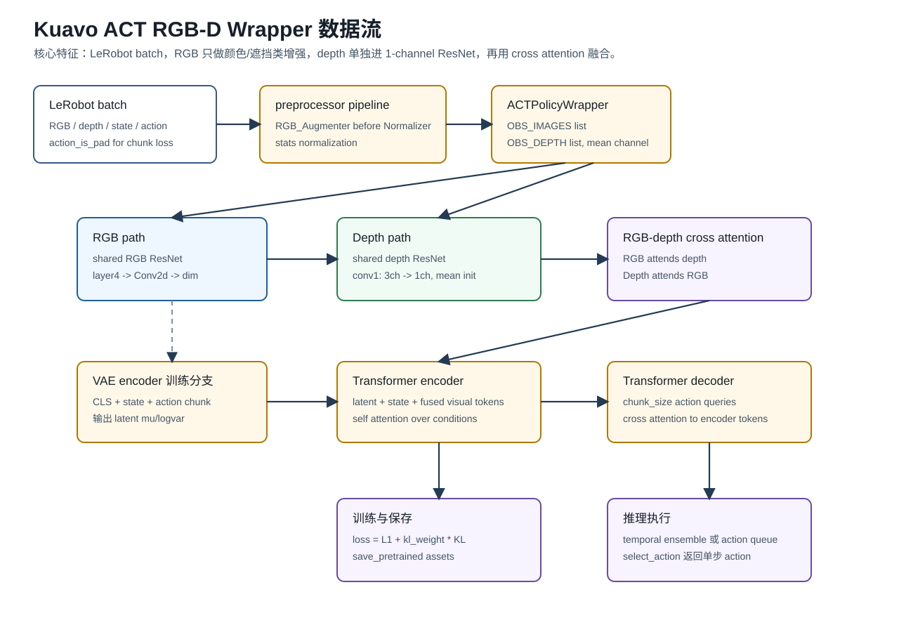
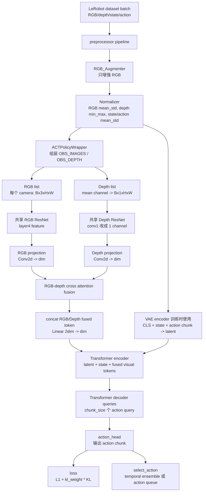

# Kuavo ACT 流程梳理

> 生成日期：2026-05-14  
> 用途：在进入 Kuavo-DECO 第三阶段模型适配前，先静态梳理 DECO 原生流程、Kuavo ACT RGB-D wrapper 流程，以及第三阶段需要复用和替换的边界。  
> 约束：本文只基于源码静态阅读，不代表已经运行训练、forward 或部署验证。

---
## 1. 静态阅读范围

本次主要参考以下文件：

- `kuavo_train/train_policy.py`：Kuavo LeRobot 训练入口、preprocessor、RGB augmentation 插入点、保存逻辑。
- `kuavo_train/wrapper/policy/act/ACTPolicyWrapper.py`：Kuavo ACT policy wrapper。
- `kuavo_train/wrapper/policy/act/ACTModelWrapper.py`：Kuavo ACT RGB-D 模型改造、depth backbone、cross-modal fusion。
- `kuavo_train/utils/transforms.py`：Kuavo RGB_Augmenter 的具体 transform。
- `configs/policy/act_config.yaml`：Kuavo ACT 训练和增强配置模板。


## 2. Kuavo ACT RGB-D Wrapper 整体流程






### 2.1 Kuavo ACT 的数据入口

Kuavo ACT 使用 LeRobot dataset。训练入口 `kuavo_train/train_policy.py` 会：

1. 读取 `LeRobotDatasetMetadata`。
2. 通过 `dataset_to_policy_features` 区分 RGB、DEPTH、STATE、ACTION。
3. 构造 `CustomACTConfigWrapper`。
4. 构造 `CustomACTPolicyWrapper`。
5. 调用 LeRobot 的 `make_pre_post_processors`，创建 normalizer 和 postprocessor。
6. 在 normalizer 前插入 `AugmentationProcessorStep`。
7. 每个 batch 先经过 preprocessor，再进入 policy forward。

### 2.2 Kuavo ACT 的图像增强

Kuavo 当前增强配置在 `configs/policy/act_config.yaml`：

- `Identity`
- `ColorJitter`：brightness、contrast、saturation、hue
- `SharpnessJitter`
- `RandomMask`
- `RandomBorderCutout`
- `GaussianNoise`
- `GammaCorrection`

SharpnessJitter (锐度抖动)
- 随机调整图像的锐度（Sharpness）。
- 它可以让图像变得更模糊（Blurry），也可以让边缘变得过度锐利（Over-sharpened）。
- 作用：在真实机器人运行中，由于机器人的快速移动，或者相机对焦不准（例如物体突然靠近镜头），经常会产生模糊的画面。加入锐度抖动能让模型在这种失焦或运动模糊的情况下依然能正常工作。

RandomMask (随机遮挡)
- 在图像的随机位置覆盖一个或多个纯色块（通常是黑色、灰色或随机噪声块）。
- 这是一种类似于 Dropout 在图像层面的应用（常被称为 Cutout）。
- 作用：强制神经网络不要只盯着物体的一个局部特征（比如只看杯子的把手）。当把手被遮挡时，网络必须学会依靠杯子的轮廓、颜色等其他特征来完成任务。这对于机器人尤其重要，因为在操作过程中，机械臂末端执行器（Gripper）经常会自我遮挡视线。

RandomBorderCutout (随机边缘裁剪/遮挡)
- 这是 RandomMask 的一种变体，专门针对图像的边缘区域进行随机遮挡或裁剪。
- 作用：机器人的广角或鱼眼相机在边缘处往往存在畸变，或者边缘经常会拍到无关的背景环境（如房间角落、支架）。随机遮挡边缘可以强制模型将注意力（Attention）集中在图像中央的“操作区域（Workspace）”，减少背景干扰导致的过拟合。

GaussianNoise (高斯噪声)
- 向图像的每个像素点添加服从高斯分布（正态分布）的随机噪声。直观表现为图像上出现细小的噪点。
- 作用：模拟真实相机传感器底层的热噪声或电子噪声。在光线较暗的环境下，物理相机的噪点会非常明显。添加高斯噪声可以防止模型把这些“噪点”误认为是环境特征，提升其在低照度下的表现。

GammaCorrection (伽马校正)
- 这是一种非线性的亮度调整方法。它不会像 brightness 那样简单粗暴地加减像素值，而是通过幂函数曲线来调整。
- 调节 Gamma 值可以提亮图像的暗部细节（拉高暗部），同时尽量保证高光部分不至于过曝（变成纯白）；或者反过来压暗图像。
- 作用：不同的相机 ISP（图像信号处理器）有不同的动态范围和曝光策略。伽马校正能非常逼真地模拟不同相机硬件的成像差异，以及复杂光比环境（例如有阳光直射的窗边）下的视觉输入。


这些增强由 `kuavo_train/utils/transforms.py` 中的 `ImageTransforms` 和 `RandomSubsetApply` 组织。训练入口中的 `AugmentationProcessorStep` 只对 RGB camera key 生效：

```text
self.cam_keys = [k for k in cam_keys if "depth" not in k]
```

因此 Kuavo 当前策略是：

- RGB 可以做颜色、遮挡、噪声、gamma 等 photometric augmentation。
- depth 不做颜色类增强。
- 如果需要 crop/resize，depth 应与 RGB 使用一致的空间参数，并使用 nearest 插值，避免破坏深度物理意义。

### 2.3 Kuavo ACT 用几个 ResNet，怎么融合

Kuavo ACT RGB-D wrapper 中有两条视觉路径：

```text
RGB path:   RGB image -> RGB ResNet -> RGB feature map -> projection
Depth path: depth map -> Depth ResNet -> depth feature map -> projection
```

depth backbone 的关键改造是把第一层卷积从 3-channel 改成 1-channel：

```text
old_conv.weight.mean(dim=1, keepdim=True)
```

也就是用 RGB ResNet 第一层卷积权重在颜色通道维求均值，初始化 depth conv1。这比随机初始化更稳，因为它保留了低层边缘/纹理滤波器的统计结构。

RGB 和 depth 分别得到空间 token 后，进入 `CrossModalAttentionFusion`：

```text
RGB query attends depth key/value
Depth query attends RGB key/value
fused = Linear(concat(fused_rgb, fused_depth))
```

最后融合 token 被送入 ACT transformer encoder。

### 2.4 ACT 主干和训练目标

ACT 与 DECO 最大区别是动作生成范式不同。

ACT 训练时有 VAE encoder：

```text
CLS + robot_state + action_chunk -> latent mu/logvar
```

然后 ACT transformer encoder 接收：

```text
latent token + state token + visual tokens
```

decoder 使用 `chunk_size` 个 learned action query，通过 cross attention 输出 action chunk。

ACT loss 是：

```text
L1(action_hat, action) + kl_weight * KL(latent, N(0, 1))
```

DECO 则不是 VAE，不直接回归 action，而是学习从噪声 action 到真实 action 的 Flow Matching 向量场。

### 2.5 ACT 训练结果后怎么操作

Kuavo ACT wrapper 走 LeRobot `PreTrainedPolicy` 保存体系：

- `policy.save_pretrained(output_directory)`
- `epochbest/`
- `epochN/`
- `learning_state.pth`
- `rng_state.pth`
- preprocessor / postprocessor 配置

推理时通过 `select_action(batch)`：

- 如果启用 temporal ensemble，则每一步重新预测 chunk 并做在线加权平均。
- 如果不用 temporal ensemble，则 action queue 为空时预测 chunk，然后逐步 pop 动作。

这个模式是 Kuavo 部署侧希望保留的接口形态。
