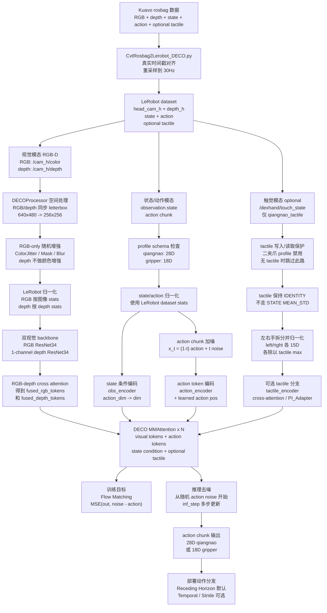

# Kuavo-DECO 流程梳理

> 生成日期：2026-05-21  
> 用途：基于当前已经插入 Kuavo 工具链的 DECO 逻辑，重新梳理从 rosbag 数据、LeRobot 数据集、DECOProcessor、模型前向、Flow Matching 训练到部署消费动作队列的完整流程。  
> 边界：本文是架构与数据流说明，不是运行报告；不代表已经执行训练、forward、validator、仿真或实机验证。

---

## 1. 这份文档说明什么

原生 DECO 的核心假设是：

- 数据来自 DECO 自己的 episode 目录。
- 视觉输入是两张 RGB 图像。
- 触觉输入来自 Inspire Hand 的高维 tactile 数据。
- 训练和部署资产主要围绕 `.pth` checkpoint 组织。

Kuavo-DECO 当前已经不是直接运行原生 DECO，而是把 DECO 主干嵌入到 Kuavo / LeRobot 工具链中。新的核心假设是：

- 数据入口是 Kuavo rosbag。
- 数据集格式是 LeRobot dataset。
- 视觉输入是头部 RGB + 对齐 depth，不再是双 RGB。
- 视觉前端采用 Kuavo/ACT 风格 RGB-D 编码与 cross attention 融合。
- DECO 的 action-token Flow Matching 主干保留。
- 触觉分支只在 `qiangnao_tactile` profile 下可选启用。
- 部署资产采用 Kuavo run root 组织方式，而不是只依赖原生 `.pth` 文件。

一句话总结：

```text
Kuavo-DECO = Kuavo/LeRobot 数据与部署外壳
           + Kuavo RGB-D 视觉前端
           + DECO action-token Flow Matching 主干
           + 可选 Kuavo 30D tactile PI_Adapter
```

---

## 2. 总体流程



这条流程里有两个频率概念必须分开：

- `train_hz=30`：数据转换和训练数据集的时间轴频率。
- `control_hz=10`：部署阶段机器人实际消费动作的控制频率。

`inf_step` 也不要和这两个频率混淆。`inf_step` 只表示 Flow Matching 推理时的去噪步数。

---

## 3. 数据转换阶段

### 3.1 原始 rosbag 输入

Kuavo-DECO 数据转换阶段使用 Kuavo rosbag 中的多模态数据：

```text
RGB:     /cam_h/color/image_raw/compressed
depth:   /cam_h/depth/image_raw/compressed
         或 /cam_h/depth/image_raw/compressedDepth
state:   /sensors_data_raw 等 Kuavo 状态话题
action:  /kuavo_arm_traj_synced、/kuavo_arm_traj、/control_robot_hand_position 等动作话题
tactile: /dexhand/touch_state，仅 qiangnao_tactile 可选使用
```

当前 inspector 记录中，`/cam_h/color/image_raw/compressed` 原始解码尺寸是 `848x480`。这不是模型最终输入尺寸。当前链路里的尺寸关系是：

```text
rosbag 原始 RGB:     848x480
转换/保存默认 resize: 640x480
DECOProcessor 输入模型前: 256x256 letterbox
```

因此：

- `848x480` 描述的是当前 rosbag 里头部 RGB topic 的原始图像尺寸。
- `640x480` 描述的是 Kuavo/LeRobot 数据转换和部署配置中的默认 resize 尺寸。
- `256x256` 描述的是 DECO 视觉主干前的统一模型输入尺寸。

### 3.2 depth topic 与 decoder

当前 depth 默认优先使用：

```text
/cam_h/depth/image_raw/compressed + compressed_image
```

同时兼容：

```text
/cam_h/depth/image_raw/compressedDepth + compressedDepth_png
```

两者区别是：

- `compressed_image`：按普通 `sensor_msgs/CompressedImage` 直接解码。
- `compressedDepth_png`：按 ROS compressedDepth 格式跳过 PNG payload 前面的配置头，再解码 PNG。

当前第一版 depth 保存策略是：

```text
uint16/mm depth
  -> depth_range clip
  -> per-frame normalize
  -> uint8
  -> repeat 3 channels
  -> LeRobot image/video writer
```

这个策略的优点是兼容当前 Kuavo ACT/DP 既有图像写入链路；缺点是它不严格保留跨帧绝对毫米尺度。进入 DECO wrapper 后，会再取单通道语义送入 1-channel depth backbone。

### 3.3 profile 决定 state/action/tactile schema

Kuavo-DECO 不再把所有任务固定成单一 28D。当前通过 `end_effector_profile` 区分末端类型。

#### qiangnao_tactile

用于强脑灵巧手：

```text
observation.state:
  左臂 7 + 左手 6 + 右臂 7 + 右手 6 + 头部 2 = 28D

action:
  左臂 7 + 左手 6 + 右臂 7 + 右手 6 + 头部 2 = 28D

observation.tactile:
  左手 15 + 右手 15 = 30D，可选写入
```

头部 state 当前来自每个 episode 内 `joint_q[26:28]` 的实测均值。头部 action 当前补零，表示阶段一暂不主动控制头部。

#### gripper_no_tactile

用于二指夹爪：

```text
observation.state:
  左臂 7 + 左夹爪 1 + 右臂 7 + 右夹爪 1 + 头部 2 = 18D

action:
  左臂 7 + 左夹爪 1 + 右臂 7 + 右夹爪 1 + 头部 2 = 18D

observation.tactile:
  不写入，不使用
```

该 profile 必须保持：

```text
use_tactile: false
use_tactile_lora: false
training_stage: visual_main
```

---

## 4. LeRobot 数据集进入训练前发生什么

### 4.1 LeRobot dataset 字段

转换完成后的数据集由 LeRobot 管理，核心字段是：

```text
observation.images.head_cam_h
observation.depth_h
observation.state
action
observation.tactile  # 仅 qiangnao_tactile 且写入 tactile 时存在
```

DECO 不直接读取原生 `episode_xxx/colors/*.jpg`、`tactiles/*.npy`、`data.pkl` 结构。原生 `third_party/deco/dataset.py` 只作为 legacy 参考路径，不是 Kuavo-DECO 主训练入口。

### 4.2 DECOProcessor：空间预处理和 RGB 增强

进入模型前，DECOProcessor 负责做确定性的空间处理和训练期 RGB 增强。

空间处理：

```text
RGB   -> 256x256 letterbox
depth -> 256x256 letterbox
```

这里的 letterbox 是等比例缩放 + padding，不是 crop。它的目的有三个：

1. 保持画面比例，不把物体压扁。
2. 不裁切画面边缘，避免丢失机器人操作相关区域。
3. 给神经网络提供固定尺寸输入，便于 batch 堆叠。

RGB padding 默认使用灰色：

```text
128 / 255 = 0.5019607843
```

depth padding 默认使用：

```text
0.0
```

RGB 和 depth 必须共享同一个空间变换，否则 RGB 中的物体位置和 depth 中的几何位置会错位。

### 4.3 RGB 增强与 depth 增强边界

RGB 会进入随机增强池，例如：

```text
Identity
ColorJitter
SharpnessJitter
RandomMask
RandomBorderCutout
GaussianNoise
GammaCorrection
GaussianBlur
```

这些增强用于提高真实部署时的鲁棒性，例如光照变化、轻微模糊、传感器噪声、局部遮挡等。

depth 不做颜色类增强。原因是 depth 表示几何距离，不是颜色纹理。对 depth 做 ColorJitter、GammaCorrection 这类颜色增强会破坏深度的物理语义。

当前策略是：

```text
RGB/depth 共享空间 letterbox
RGB 独立进入随机增强池
depth 只保留几何同步处理，不进入颜色增强池
```

### 4.4 LeRobot Normalizer

DECOProcessor 后，LeRobot processor/normalizer 继续负责特征归一化。

当前语义是：

```text
RGB:    使用图像归一化或 dataset stats
depth:  使用 depth 对应归一化策略
state:  使用 dataset stats
action: 使用 dataset stats
tactile: IDENTITY，不走普通 STATE 的 MEAN_STD
```

tactile 不能被当成普通 state 一起做 `MEAN_STD`，因为 DECO tactile 分支需要保留自己的一套左右手 max normalize 逻辑。

---

## 5. Wrapper 做什么

Kuavo-DECO 的训练入口不是直接调用原生 `third_party/deco/train.py`，而是通过 Kuavo policy wrapper 接入。

Wrapper 的职责是：

```text
LeRobot batch
  -> 解包 RGB/depth/state/action/tactile
  -> 检查 action_dim 和 profile 是否一致
  -> 将 3-channel depth 转成 1-channel depth 语义
  -> tactile 拆成 left/right 各 15D 并除以 tactile max
  -> 调用 third_party/deco/models/deco/deco.py 中的 DECO 主体
  -> 训练时返回 loss
  -> 推理时维护 action queue
```

Wrapper 不是简单的转发层。它是 Kuavo/LeRobot 资产格式与 DECO 模型主体之间的接口边界。

---

## 6. Kuavo-DECO 视觉前端

### 6.1 原生双 RGB 被替换为 RGB-D

原生 DECO 的视觉入口是：

```text
img1 + img2
  -> batch 维拼接
  -> 共享 ResNet34
  -> 拆回两路视觉 token
```

Kuavo-DECO 当前视觉入口是：

```text
RGB + depth
  -> RGB ResNet backbone
  -> 1-channel depth ResNet backbone
  -> RGB-depth cross attention
  -> fused_rgb_tokens + fused_depth_tokens
```

关键变化：

- 不再把 `/cam_h` 图像左右切成伪双目。
- 不再把单目 RGB 复制成两路。
- 不再沿用“两个 RGB 视角”的语义。
- 保留“两路视觉 token”的结构，但把语义改成 `fused_rgb` 和 `fused_depth`。

### 6.2 RGB backbone

RGB 分支默认使用：

```text
resnet34
```

也允许配置为：

```text
resnet18
```

RGB 输入形状：

```text
(B, 3, 256, 256)
```

backbone 输出 layer4 feature map，再通过 projection 映射到 DECO hidden dim。

### 6.3 depth backbone

depth 分支同样默认使用 ResNet 系列，但第一层卷积改为 1-channel 输入。

depth 输入形状：

```text
(B, 1, 256, 256)
```

depth backbone 的第一层初始化策略参考 Kuavo ACT RGB-D 前端：

```text
depth_conv1_weight = mean(rgb_conv1_weight, dim=channel)
```

也就是把 RGB ResNet 第一层的 3 通道卷积权重在通道维求平均，用来初始化 depth 的 1 通道卷积。这样比完全随机初始化更稳定，同时保留 depth 作为独立模态的结构。

RGB 和 depth 不共享同一个 ResNet。原因是：

- RGB 表示纹理、颜色、边缘、语义外观。
- depth 表示距离、几何结构、空间形状。
- 两者数据分布不同，强行共享 backbone 会混淆模态语义。

### 6.4 RGB-depth cross attention

两个 backbone 得到空间 feature map 后，都会被展平成 token：

```text
RGB feature:   (B, C, H', W') -> (B, L, D)
depth feature: (B, C, H', W') -> (B, L, D)
```

其中：

```text
L = H' * W'
D = DECO hidden dim
```

然后执行 cross attention：

```text
RGB query   attends to depth key/value -> fused_rgb_tokens
depth query attends to RGB key/value   -> fused_depth_tokens
```

直观理解：

- RGB token 可以询问 depth：“我看到这个区域像是物体边缘，它在几何上是否也有距离突变？”
- depth token 可以询问 RGB：“这里距离有变化，它在颜色纹理上是否对应真实物体边界？”

最终保留两路 token：

```text
fused_rgb_tokens:   (B, L, D)
fused_depth_tokens: (B, L, D)
visual_tokens:      (B, 2L, D)
```

这样做是为了尽量兼容 DECO 原生 `MMAttention` 中“两路视觉 token”的结构假设，同时把语义从“双 RGB”改成“RGB-D”。

---

## 7. State 条件如何进入模型

DECO 没有把 state 当成 ACT 那种 decoder token，也没有使用 ACT 的 VAE encoder 路线。Kuavo-DECO 保留 DECO 原生思路：

```text
observation.state
  -> obs_encoder(action_dim -> dim)
  -> 加到 time embedding condition
  -> 调制 MMAttention / action denoising
```

profile 决定 state 维度：

```text
qiangnao_tactile:   state_dim = 28
gripper_no_tactile: state_dim = 18
```

这意味着 state/action 维度必须和 policy 配置严格匹配：

```text
28D checkpoint 不能直接用于 18D gripper
18D checkpoint 不能直接用于 28D qiangnao
```

---

## 8. Action token 与 Flow Matching

### 8.1 action chunk

DECO 一次不是只预测一个动作，而是预测一个未来动作片段：

```text
action: (B, chunk_size, action_dim)
```

其中：

```text
chunk_size = 一次预测的未来动作长度
action_dim = 28 或 18，取决于 profile
```

`chunk_size` 不是视觉帧数，也不是控制频率。

### 8.2 训练时如何加噪

Flow Matching 训练阶段，模型不是直接从 observation 回归 action，而是学习从噪声动作流向真实动作的向量场。

训练时随机采样时间：

```text
t ~ Uniform(0, 1)
```

然后对真实 action chunk 加噪：

```text
x_t = (1 - t) * action + t * noise
```

其中：

- `action` 是真实动作。
- `noise` 是随机噪声。
- `x_t` 是介于真实动作和随机噪声之间的中间状态。

当 `t` 接近 0，`x_t` 更接近真实 action。  
当 `t` 接近 1，`x_t` 更接近随机 noise。

### 8.3 模型要预测什么

模型输入：

```text
RGB-D visual tokens
state condition
optional tactile condition
noisy action tokens x_t
timestep t
```

模型输出目标：

```text
target = noise - action
```

训练 loss 保留 DECO 原生形式：

```text
F.mse_loss(out, noise - action)
```

当前第一版不额外乘 `action_is_pad` mask。这是为了严格对齐 DECO 原生 loss 行为。

### 8.4 推理时如何去噪

推理时没有真实 action。DECO 从随机 action noise 开始：

```text
initial_action = random noise
```

然后按 `inf_step` 做多步去噪，逐步把随机动作推向符合当前 RGB-D、state、tactile 条件的动作 chunk。

输出形状：

```text
qiangnao_tactile / qiangnao_no_tactile:
  (chunk_size, 28)

gripper_no_tactile:
  (chunk_size, 18)
```

---

## 9. MMAttention 主干保留了什么

Kuavo-DECO 的核心策略不是重写 DECO Transformer，而是尽量保留原生 action-token 主干。

保留的部分包括：

- `action_encoder`
- learned action position embedding
- image/action joint attention
- `MMAttention`
- Flow Matching 加噪和去噪逻辑
- `linear` action head
- 可选 `PI_Adapter` plugin 机制

被替换或改造的部分包括：

- 原生双 RGB 输入被替换为 RGB-D 输入。
- 原生共享 ResNet34 双视角编码被替换为 RGB backbone + depth backbone。
- 原生 Inspire Hand tactile 处理被替换为 Kuavo 30D tactile。
- 原生数据读取与训练外壳被替换为 Kuavo/LeRobot wrapper。

因此，Kuavo-DECO 的模型边界可以理解为：

```text
外壳换成 Kuavo/LeRobot
视觉前端换成 RGB-D
action-token Flow Matching 主干尽量保留
```

---

## 10. tactile 分支

### 10.1 tactile 数据从哪里来

Kuavo tactile 来自：

```text
/dexhand/touch_state
```

当前只使用双手指尖/指腹法向力：

```text
5 指 * 3 点 * 2 手 = 30D
```

数据转换阶段会把 Kuavo 原始 normal force 除以 100，转换到当前约定的牛顿量纲。

### 10.2 wrapper 中如何归一化 tactile

LeRobot Normalizer 不对 tactile 做 `MEAN_STD`。进入 wrapper 后，tactile 拆成：

```text
tac1 = tactile[..., :15]   # 左手
tac2 = tactile[..., 15:]   # 右手
```

然后执行：

```text
tac1 = tac1 / tactile_left_max
tac2 = tac2 / tactile_right_max
```

如果开启：

```text
clip_tactile_to_unit: true
```

则 tactile 会被 clamp 到 `[0, 1]`。

`tactile_left_max` 和 `tactile_right_max` 的单位必须和转换后的 tactile 一致，也就是 Kuavo normal force `/100` 之后的牛顿值。

### 10.3 两阶段训练

Kuavo-DECO 当前推荐两阶段训练。

#### 第一阶段：visual_main

第一阶段训练 RGB-D + state 主干：

```text
training_stage: visual_main
use_tactile: false
use_tactile_lora: false
```

该阶段适用于：

- 强脑灵巧手无触觉训练。
- 二指夹爪训练。
- 触觉 adapter 的 base policy 训练。

#### 第二阶段：tactile_adapter

第二阶段只适用于 `qiangnao_tactile`：

```text
training_stage: tactile_adapter
use_tactile: true
use_tactile_lora: true
base_policy_path: 第一阶段选定 epoch 的 policy 权重目录
tactile_left_max: 正数
tactile_right_max: 正数
```

该阶段会加载第一阶段 checkpoint，并在 `freeze_pretrained_main=true` 时冻结已经匹配的主干参数，只训练 tactile 相关新增分支，例如：

```text
tactile_encoder
tactile cross-attention
PI_Adapter
必要桥接参数
```

### 10.4 PI_Adapter 不是外部 PEFT LoRA

配置里的：

```text
use_tactile_lora: true
```

对应的是 DECO 源码内的：

```text
plugin=True
PI_Adapter
```

它不是 Hugging Face PEFT LoRA，也不是额外注入的第三方 LoRA 框架。它是 DECO 自己实现的低秩 residual adapter。

---

## 11. 训练资产如何保存

原生 DECO 训练主要保存 `.pth` 文件，例如：

```text
best.pth
epoch_x_loss_y.pth
last_weights.pth
```

Kuavo-DECO 正式训练资产遵循 Kuavo/LeRobot run root：

```text
outputs/train/<task>/<method>/<timestamp>/
  config.json
  policy_preprocessor.json
  policy_postprocessor.json
  epoch*/
    model.safetensors 或等价 policy 权重
```

部署时不建议只拷贝单独的 `epochbest/` 或单个权重文件。部署需要 run root 中的配置、preprocessor、postprocessor 和权重目录保持一致。

`.pth` 当前只作为兼容入口，例如导入历史 DECO 原生权重或可信本地 checkpoint；它不是 Kuavo-DECO 正式训练和部署资产的主格式。

---

## 12. 部署流程

### 12.1 部署入口

Kuavo-DECO 部署使用：

```text
configs/deploy/kuavo_deco_env.yaml
```

核心模式包括：

```text
qiangnao_no_tactile
qiangnao_tactile
gripper_no_tactile
```

它们分别对应：

```text
qiangnao_no_tactile:
  28D 灵巧手，不输入 tactile，加载第一阶段视觉主干 checkpoint。

qiangnao_tactile:
  28D 灵巧手 + 30D tactile，加载第二阶段 tactile adapter checkpoint。

gripper_no_tactile:
  18D 二指夹爪，不输入 tactile，加载 18D visual_main checkpoint。
```

### 12.2 部署时 preprocessor 和 postprocessor 的归属

本地部署时：

```text
实时 observation
  -> run-root preprocessor
  -> policy 推理
  -> run-root postprocessor
  -> robot action
```

server/client 模式下，当前语义是：

```text
client/eval 侧:
  采集 observation
  执行 run-root preprocessor
  调用 server
  执行 postprocessor
  下发动作

server 侧:
  只负责 processed observation -> raw model action
```

不要让 client 和 server 两边重复执行 preprocessor 或 postprocessor。

### 12.3 action dispatcher 和控制频率

DECO 推理一次输出一个 action chunk：

```text
(chunk_size, action_dim)
```

部署 wrapper 通过 `deco.action_dispatch.mode` 选择唯一策略。默认 Receding Horizon 按 30Hz 连续消费原始 action；Temporal Ensembling 同样按 30Hz 每周期重推理；只有显式 Stride Action 才按 `target_hz` 降采样。

因此：

- `chunk_size` 决定一次推理预测多少未来动作。
- `inf_step` 决定一次推理内部做多少步去噪。
- `env.ros_rate` 决定机器人实际消费动作的目标频率，并必须与当前 dispatcher 的时间语义一致。

三者是不同概念。

---

## 13. 和原生 DECO 的关键差异

| 项目 | 原生 DECO | Kuavo-DECO |
|---|---|---|
| 数据来源 | DECO episode 目录 | Kuavo rosbag |
| 数据格式 | colors / tactiles / data.pkl | LeRobot dataset |
| RGB 输入 | 两张 RGB 图像 | 头部 RGB |
| depth 输入 | 无 | 头部 depth |
| 视觉编码 | 双 RGB batch 维拼接，共享 ResNet34 | RGB backbone + 1-channel depth backbone |
| 视觉 token 语义 | img1 tokens + img2 tokens | fused RGB tokens + fused depth tokens |
| 图像尺寸链路 | 原生 resize/letterbox | rosbag 848x480 -> dataset 640x480 -> model 256x256 letterbox |
| state/action | 固定 28D | 28D qiangnao 或 18D gripper |
| tactile | Inspire Hand 高维 tactile | Kuavo 30D tactile |
| tactile adapter | 原生 plugin / PI_Adapter | 保留 PI_Adapter，但只在 qiangnao_tactile 二阶段启用 |
| 训练入口 | `third_party/deco/train.py` | `kuavo_train/train_policy.py` + wrapper |
| 部署入口 | `third_party/deco/inference.py` | `kuavo_deploy` + `kuavo_deco_env.yaml` |
| 权重资产 | `.pth` | Kuavo run root + policy 权重 + processor |

---

## 14. 常见误解

### 14.1 `/cam_h/color/image_raw/compressed` 是 848x480，为什么配置里是 640x480？

两者不是同一层。

```text
848x480: rosbag 原始 topic 解码尺寸
640x480: 转换/保存/部署配置默认 resize 尺寸
256x256: 模型前 letterbox 后尺寸
```

### 14.2 Kuavo-DECO 还在用双目 RGB 吗？

不使用。

当前头部 RGB 是完整单路 RGB 画面，左右半图只是同一画面的裁切，不是真实双目。因此 Kuavo-DECO 主路线是 RGB-D，而不是双 RGB。

### 14.3 depth 是不是严格 metric depth？

当前第一版不是严格 metric depth 保真方案。它沿用 Kuavo ACT/DP 兼容链路，把 depth clip 后 per-frame normalize 成 uint8 并 repeat 成 3 通道保存。wrapper 再取单通道进入 depth backbone。

如果未来要保留严格毫米尺度，需要同步升级：

```text
converter
validator
LeRobot feature schema
policy config
DECOProcessor
deploy observation pipeline
```

### 14.4 `use_tactile_lora` 是不是 PEFT LoRA？

不是。

它对应 DECO 自实现的 `plugin=True` / `PI_Adapter`。这是模型内部的低秩 residual adapter，不是外部 PEFT LoRA。

### 14.5 二夹爪能不能开 tactile？

不能。

`gripper_no_tactile` 必须保持：

```text
use_tactile: false
use_tactile_lora: false
```

也不能使用：

```text
training_stage: tactile_adapter
```

### 14.6 `inf_step=10` 是不是代表 10Hz？

不是。

`inf_step` 是 Flow Matching 去噪步数。  
`control_hz` 才是机器人部署控制频率。

---

## 15. 最小心智模型

如果只记一条线，可以这样理解：

```text
Kuavo rosbag
  -> 30Hz LeRobot RGB-D dataset
  -> DECOProcessor 做 256x256 RGB/depth 同步 letterbox
  -> LeRobot Normalizer 归一化 RGB/depth/state/action
  -> wrapper 准备 profile、depth 单通道、optional tactile
  -> RGB backbone + depth backbone + cross attention
  -> DECO action-token Flow Matching transformer
  -> action chunk
  -> 默认 30Hz Receding Horizon 连续消费；Temporal Ensembling / Stride Action 可显式选择
```

其中真正从原生 DECO 保留下来的核心是：

```text
action token 表示
MMAttention 主干
Flow Matching 训练目标
多步去噪推理
可选 PI_Adapter 思路
```

真正被 Kuavo 工具链替换的是：

```text
数据格式
训练入口
视觉前端
触觉维度
权重资产组织
部署入口
```
