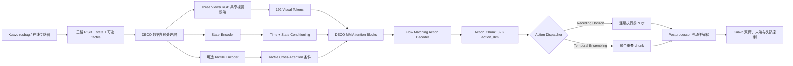
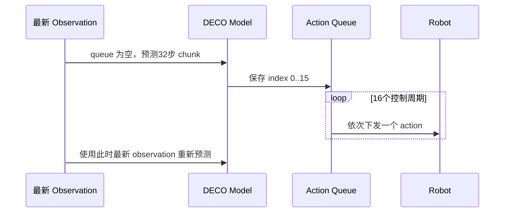

# Kuavo-DECO Three Views RGB 技术架构说明

> **文档状态**：当前架构唯一真理源（Single Source of Truth）
>
> **适用分支**：`deco/feature/3view-rgb`
>
> **收束日期**：2026-08-08
>
> **验证边界**：本文基于当前仓库代码与配置进行静态核对；训练、仿真和实机行为仍须在允许执行代码的环境中验证。

---

## 1. 文档目标

本文解释 Kuavo-DECO 从数据转换、Three Views RGB 视觉编码、DECO Action-Token Flow Matching 主干、action chunk 预测，到在线动作分发与机器人执行的完整架构。

当前方案已经冻结为：

- 前端固定使用三路 RGB：头部相机、左腕相机、右腕相机。
- 三路 RGB 共用一套视觉 backbone，通过 camera embedding 区分物理视角。
- 后端保留 DECO 的 Action-Token Flow Matching，一次预测一个固定长度的 action chunk。
- 在线部署通过独立 dispatcher 消费 action chunk；dispatcher 不改变模型结构、训练 loss 或 checkpoint 权重形状。
- 末端执行器支持28维灵巧手 schema 与18维二夹爪 schema。
- 强脑灵巧手可选第二阶段30维触觉 adapter；二夹爪仅使用视觉主干。

本文替代此前根目录中的 RGB-D 宏观计划，以及 `docs/plans/2026-07-26-3view-rgb-action-dispatch.md` 中的独立动作分发计划。历史 RGB-D、depth backbone、前端 RGB-depth cross-attention 与 stride 降频方案不再属于当前有效架构。

---

## 2. 架构总览



架构由五个职责明确的层组成：

1. **数据与预处理层**：把 rosbag 或在线 ROS observation 转成模型输入契约。
2. **Three Views RGB 前端**：把三个固定相机视角编码成带相机身份和二维空间位置的视觉 token。
3. **DECO 模型主体**：联合视觉、state、action token 和可选 tactile 条件，学习 Flow Matching 速度场。
4. **Policy Wrapper 与动作分发层**：连接 LeRobot 训练/部署接口，并决定 action chunk 的在线时间消费方式。
5. **机器人执行层**：把18D或28D模型动作解释成双臂、末端执行器和头部命令。

这些边界意味着视觉前端、模型一次预测多少步，以及部署时每次使用多少步，是三个不同问题，不能混用同一参数描述。

---

## 3. 输入数据与特征契约

### 3.1 固定三相机输入

三路 RGB 的物理顺序固定为：

| 视角索引 | 数据 key | 默认 ROS topic | 物理语义 |
|---:|---|---|---|
| 0 | `observation.images.head_cam_h` | `/cam_h/color/image_raw/compressed` | 头部全局视角 |
| 1 | `observation.images.wrist_cam_l` | `/cam_l/color/image_raw/compressed` | 左腕局部操作视角 |
| 2 | `observation.images.wrist_cam_r` | `/cam_r/color/image_raw/compressed` | 右腕局部操作视角 |

该顺序同时约束数据转换、训练 processor、policy wrapper、模型 camera embedding、仿真、实机以及 server/client 部署。系统不提供 N-view、head-only、复制 head 图像或复用旧帧等静默降级路径。

任一路相机缺失、key 重复、通道数不是3、三路空间 shape 不一致，或者部署侧无法提供对应 observation 时，当前实现会显式失败，避免相机身份错位后继续输出机器人动作。

### 3.2 时间轴

- LeRobot 数据集目标频率默认为30Hz。
- 数据转换以 head RGB 为主时间轴，对齐左右腕 RGB、state、action 与可选 tactile。
- checkpoint 中的 `dataset_hz` 来自数据集 metadata。
- 部署侧 `env.ros_rate` 必须与 checkpoint 的 `dataset_hz` 完全一致。

`dataset_hz` 定义 action 序列的物理时间语义。部署时单独降低 `ros_rate` 会把相同 action index 拉长到不同的真实时间，因此当前配置禁止这种不匹配。

### 3.3 State、Action 与 Tactile schema

| Profile | State / Action 维度 | 排列 | Tactile |
|---|---:|---|---|
| `qiangnao_tactile` | 28D | 左臂7 + 左手6 + 右臂7 + 右手6 + 头部2 | 可选30D |
| `gripper_no_tactile` | 18D | 左臂7 + 左夹爪1 + 右臂7 + 右夹爪1 + 头部2 | 禁止 |

28D schema 中，头部位于索引26–27；18D schema 中，头部位于索引16–17。`leju_claw` 与 `rq2f85` 在 ROS topic 和数值尺度上不同，但进入模型后共享18D schema。

强脑触觉只保留双手五指、每指三点的法向力，共 `15 + 15 = 30` 维。数据转换先按 `normal_force / 100` 转为牛顿量纲；触觉不进入 LeRobot 的 STATE `MEAN_STD`，而是在 wrapper 中分别除以 `tactile_left_max` 和 `tactile_right_max`，默认裁剪到 `[0, 1]`。

---

## 4. 数据转换与预处理

### 4.1 Rosbag 到 LeRobot

`kuavo_data/CvtRosbag2Lerobot_DECO.py` 是 DECO 专用转换入口，配置来源为 `configs/data/KuavoRosbag2Lerobot_deco.yaml`。当前有效输出包括：

- 固定三路 RGB；
- profile 对应的 `observation.state`；
- profile 对应的 `action`；
- 仅强脑灵巧手数据可选的 `observation.tactile`。

当前训练版本不读取、不对齐、不创建或写入 depth feature。转换代码中保留的历史 depth 注释不是活动数据路径。

### 4.2 训练与部署共用的图像预处理

三路 RGB 进入模型前遵循相同顺序：

```text
raw RGB
  -> batch/device 处理
  -> 256×256 deterministic letterbox
  -> 训练期 RGB random augmentation
  -> LeRobot VISUAL MEAN_STD normalization
  -> policy wrapper
```

- 默认目标尺寸为 `256×256`。
- letterbox 保持原图宽高比，RGB padding 使用 `128/255` 的灰色值。
- 随机增强只在训练期启用，不改变部署输入契约。
- 三路 RGB 必须共享源空间尺寸和处理后的空间尺寸。
- processor 构造参数随 run-root 资产保存，部署时从 `policy_preprocessor.json` 恢复。

预处理不放进 `DECO.forward()`，从而保持 raw-pixel 空间处理、LeRobot normalization 与模型主体三者职责分离。

---

## 5. Three Views RGB 视觉前端

### 5.1 Tensor 形状

经过预处理后，每个 batch 的视觉输入为：

```text
[B, 3 views, 3 channels, 256, 256]
```

模型首先沿视角维合并：

```text
[B, 3, 3, 256, 256]
  -> [B×3, 3, 256, 256]
```

三个视角随后共用同一个 ResNet backbone 和 `img_head`。默认 ResNet34 的 layer4 空间输出为 `8×8`，因此每个视角产生64个视觉 token：

```text
[B×3, 512, 8, 8]
  -> img_head
  -> [B, 3, 64, 512]
  -> [B, 192, 512]
```

其中默认隐藏维度 `dim=512`，视觉 token 总数为 `3×64=192`。

### 5.2 为什么共享 backbone

三相机共享 backbone 有三个目的：

- 使用同一视觉特征空间表达全局视角与左右腕局部视角；
- 避免为三个相机复制三套完整 ResNet 参数；
- 保持与 DECO 原生多图共享编码器思路相近，减少主干改动面。

共享 backbone 不代表模型无法区分相机。视角身份由独立的 camera embedding 提供。

### 5.3 Camera Embedding 与二维 RoPE

视觉位置由两类编码共同表达：

- **Camera embedding**：标识 token 来自 head、left wrist 或 right wrist。
- **二维 RoPE**：表达单张图像 `8×8` feature map 内部的空间位置。

三路图像分别应用同一套二维 RoPE，然后按 `[head][left wrist][right wrist]` 顺序拼接。RoPE 不跨相机建立连续坐标系，camera embedding 也不代替图像内部空间位置；两者职责互补。

---

## 6. DECO Action-Token Flow Matching 主干

### 6.1 条件输入

DECO 主干同时使用以下信息：

- 192个 Three Views RGB visual tokens；
- 当前 `observation.state`；
- 带噪 action tokens；
- Flow Matching 时间变量 `t`；
- tactile adapter 阶段可选的30D触觉条件。

state 通过两层 MLP 编码到 `dim`，并与时间 embedding 相加，作为各 MMAttention block 中 adaptive LayerNorm 的条件。当前路线不使用 ACT 的 state token/VAE 结构。

### 6.2 Action tokens

长度为 `chunk_size` 的动作序列通过 `action_encoder` 投影到隐藏维度，再加上可学习的 action positional embedding：

```text
[B, chunk_size, action_dim]
  -> action_encoder
  -> [B, chunk_size, dim]
  -> learnable action positional embedding
```

默认参数为：

| 参数 | 默认值 | 语义 |
|---|---:|---|
| `chunk_size` | 32 | 一次训练/推理覆盖的动作步数 |
| `dim` | 512 | visual/action token 隐藏维度 |
| `heads` | 8 | MMAttention 注意力头数 |
| `num_attn_blocks` | 6 | 多模态注意力 block 数量 |
| `inf_step` | 5 | 推理阶段 Flow Matching 数值求解步数 |

### 6.3 MMAttention

每个 MMAttention block 分别为 visual tokens 和 action tokens 生成 Q/K/V，再把两类序列拼接后执行 joint self-attention：

```text
visual Q/K/V ─┐
              ├─ concat -> scaled dot-product attention -> split
action Q/K/V ─┘
```

这使每个 action token 可以读取三个相机视角的信息，同时视觉 token 也在主干内部与动作表示联合更新。每个 block 使用 time/state 条件控制的 adaptive LayerNorm、attention residual 与 MLP residual。

### 6.4 Flow Matching 训练目标

训练时，对真实 action chunk `a` 采样高斯噪声 `ε` 和时间 `t`，构造插值状态：

```text
a_t = (1 - t) · a + t · ε
```

模型学习速度场 `ε - a`，当前 loss 固定为：

```python
loss = F.mse_loss(out, noise - action)
```

当前 loss 不消费 `action_is_pad` mask。因此配置要求 `drop_n_last_frames >= chunk_size - 1`；默认 chunk size 为32时，至少丢弃 episode 尾部31个无法组成完整 action chunk 的起始帧，避免 padded action 进入训练目标。

### 6.5 Flow Matching 推理

推理从随机高斯 action chunk 开始，按 `inf_step` 生成的 schedule 迭代更新：

```text
random action noise
  -> DECO velocity prediction
  -> numerical update
  -> repeat inf_step times
  -> predicted action chunk
```

`inf_step` 仅表示一次模型推理内部的去噪/积分次数。它不表示：

- action chunk 长度；
- 数据集频率；
- ROS 控制频率；
- 两次模型重新推理之间执行多少个动作。

---

## 7. Action Chunk 与在线动作分发

### 7.1 模型输出契约

模型始终一次输出完整 action chunk：

```text
qiangnao_tactile:   [B, 32, 28]
gripper_no_tactile: [B, 32, 18]
```

`chunk_size=32` 是模型结构参数，并参与 action positional embedding 和 checkpoint 权重 shape。部署期不能在不重新构造或训练模型的情况下把 checkpoint 的 chunk size 改成另一数值。

### 7.2 Dispatcher 职责边界

dispatcher 位于 policy wrapper 中，只完成以下工作：

- 判断当前控制周期是否需要重新调用模型；
- 从一个或多个预测 chunk 中选择当前时刻的单步 action；
- 保存必要的队列或重叠 chunk 状态；
- 输出诊断信息，如 chunk id、action index、队列剩余长度和推理耗时。

dispatcher 不负责 normalization、动作限幅、18D/28D schema 解释，也不修改模型预测值域。

### 7.3 Receding Horizon（默认）

默认配置为：

```yaml
chunk_size: 32
n_action_steps: 16
dataset_hz: 30
env.ros_rate: 30
```

执行过程如下：



在30Hz下连续执行16步，对应约：

```text
16 / 30 ≈ 0.533 秒
```

因此默认模型大约每16个控制周期重新推理一次；控制循环仍保持30Hz。`n_action_steps=null` 表示完整消费32步 chunk，合法的正整数不得超过 `chunk_size`。

### 7.4 Temporal Ensembling（可选）

Temporal Ensembling 每个控制周期都调用模型生成新 chunk，并对多个重叠 chunk 在同一绝对时刻的动作预测执行指数加权融合。默认系数为 `0.1`。

该模式通常能利用连续观测修正较早 chunk 的未来预测，但代价是模型需要按控制周期持续推理，并维护跨周期的 ensemble 状态。它与 Receding Horizon 互斥，不能叠加使用。

### 7.5 已删除的 stride 模式

部署期 stride 降频模式已经从配置、wrapper、dispatcher factory 和部署调用链删除。当前两种 dispatcher 都必须按 checkpoint 的 `dataset_hz` 消费原始 action index，不再通过跳过 action 或降低 `ros_rate` 改变动作时间尺度。

---

## 8. 两阶段训练与触觉 Adapter

### 8.1 Visual Main

`training_stage: visual_main` 是默认训练阶段：

- 使用 Three Views RGB、state 和完整 action chunk；
- `use_tactile=false`；
- `use_tactile_lora=false`；
- 从头训练时默认不加载外部 checkpoint；
- 同时训练视觉前端、state/action encoder、MMAttention 与 action head。

对于 `gripper_no_tactile`，只允许该阶段。

### 8.2 Tactile Adapter

`training_stage: tactile_adapter` 只适用于28D强脑灵巧手 profile：

- 加载已训练的 Visual Main checkpoint；
- 冻结已有视觉与动作主干；
- 启用30D tactile encoder 与 tactile cross-attention；
- 启用 PI-Adapter/LoRA residual 分支；
- 默认低秩 rank 为32。

触觉分支先把左右手各15维输入编码并组成64个 tactile condition token。MMAttention 使用独立 tactile key/value 做 cross-attention，将触觉修正加到 visual/action joint attention 输出上。

Visual Main 与 Tactile Adapter 是两次独立训练启动。若不需要触觉，第一阶段保存的完整 run-root 资产可以直接部署。

---

## 9. LeRobot Wrapper 与训练资产

`CustomDECOPolicyWrapper` 是 Kuavo/LeRobot 与 `third_party/deco` 模型主体之间的适配边界，负责：

- 按固定顺序堆叠三路 RGB；
- 解包 state、action 和可选 tactile；
- 执行 DECO-style tactile max normalization；
- 调用 DECO 训练 forward 或 action chunk 推理；
- 加载 `.safetensors` 或受限的历史 `.pth` 权重；
- 执行第二阶段参数冻结；
- 持有唯一 action dispatcher。

完整部署资产是 run 根目录，而不是单独的权重文件：

```text
outputs/train/<task>/<method>/<timestamp>/
```

其中 epoch 子目录提供 policy 权重，run 根目录还提供训练/部署一致的 preprocessor、postprocessor 和配置。最终保存的 policy 权重已经自包含，不继续依赖第一阶段路径或原始 `.pth` 初始化文件。

---

## 10. 部署架构

### 10.1 本地、仿真与实机

统一闭环为：

```text
ROS / simulation raw observation
  -> run-root preprocessor
  -> CustomDECOPolicyWrapper.select_action()
  -> action dispatcher
  -> run-root postprocessor
  -> 18D/28D action decoder
  -> KuavoBaseRosEnv.step()
```

训练和部署必须使用相同的三个 RGB key、相同顺序、相同 letterbox 参数与相同 normalization 资产。

### 10.2 Server / Client

server/client 模式中：

- eval/client 侧负责 run-root preprocessor 与 postprocessor；
- server 侧加载 policy，只接收已预处理 observation；
- server 返回尚未 postprocess 的单步模型 action；
- dispatcher 状态保留在 server policy 侧，保证跨请求 action queue 或 ensemble 连续。

这种分工避免 client 与 server 重复 normalization。

### 10.3 末端与头部控制

部署配置通过 `deco.inference_mode` 选择以下模式：

- `qiangnao_tactile`：28D，启用30D触觉与 tactile adapter checkpoint；
- `qiangnao_no_tactile`：28D，不订阅、不输入触觉；
- `leju_claw_no_tactile`：18D，Leju 二夹爪；
- `rq2f85_no_tactile`：18D，Robotiq 2F-85 二夹爪。

头部控制与末端 profile 分离：

- `fixed`：使用配置中的固定头部值，并保持部署期间一致；
- `policy`：使用实时头部 state，并下发模型预测的头部 action。

配置加载阶段会对 inference mode、action dimension、触觉开关、末端类型、head control 和 checkpoint 结构执行一致性检查，避免用错误 schema 加载权重。

---

## 11. 配置与代码职责映射

| 层级 | 权威文件 | 当前职责 |
|---|---|---|
| 数据配置 | `configs/data/KuavoRosbag2Lerobot_deco.yaml` | 三相机 topic、30Hz时间轴、末端 profile、触觉转换 |
| 数据转换 | `kuavo_data/CvtRosbag2Lerobot_DECO.py` | rosbag读取、时间对齐、18D/28D重排、LeRobot写入 |
| 训练配置 | `configs/policy/deco_config.yaml` | 训练阶段、chunk size、backbone、Flow Matching 与优化器参数 |
| Policy 配置 | `kuavo_train/wrapper/policy/deco/DECOConfigWrapper.py` | feature/schema/频率/阶段契约与 fail-fast 校验 |
| 图像预处理 | `kuavo_train/wrapper/policy/deco/DECOProcessor.py` | 三路 RGB letterbox 与训练/部署一致性 |
| Policy Wrapper | `kuavo_train/wrapper/policy/deco/DECOPolicyWrapper.py` | LeRobot batch、权重、loss、推理与 dispatcher 接口 |
| 模型主体 | `third_party/deco/models/deco/deco.py` | 共享视觉前端、MMAttention、Flow Matching、触觉 adapter |
| 动作分发 | `kuavo_train/wrapper/policy/deco/action_dispatch.py` | Receding Horizon 与 Temporal Ensembling |
| 部署配置 | `configs/deploy/kuavo_deco_env.yaml` | ROS频率、inference mode、head control、dispatcher 与 checkpoint |
| 部署映射 | `kuavo_deploy/utils/deco_obs_action.py` | checkpoint一致性、运行时配置、18D/28D obs/action 契约 |

LeRobot 子模块 `third_party/lerobot/` 不承载 Kuavo-DECO 定制修改；框架兼容调整应继续放在 wrapper 或 `lerobot_patches/` 中。

---

## 12. 参数语义速查

| 参数 | 所属层 | 是否影响权重 shape | 说明 |
|---|---|---:|---|
| `rgb_keys` | 数据/模型输入 | 是 | 必须恰好三项且顺序固定 |
| `vision_backbone` | 视觉前端 | 是 | 默认 ResNet34，可配置 ResNet18 |
| `dim` | 模型主体 | 是 | token 隐藏维度，默认512 |
| `chunk_size` | 模型主体 | 是 | action token 数量，默认32 |
| `action_dim` | profile | 是 | 由 profile 固定为28或18 |
| `inf_step` | Flow Matching 推理 | 否 | 单次推理内部数值求解步数 |
| `dataset_hz` | 数据时间语义 | 否 | checkpoint 动作序列频率 |
| `env.ros_rate` | 部署控制 | 否 | 必须等于 checkpoint `dataset_hz` |
| `n_action_steps` | Receding Horizon | 否 | 每次预测后连续消费的原始 action 数 |
| `temporal_ensemble.coefficient` | Temporal Ensembling | 否 | 重叠 chunk 的指数权重系数 |
| `tactile_lora_rank` | Tactile Adapter | 是 | PI-Adapter 低秩维度，默认32 |

---

## 13. 当前冻结边界

以下决策视为当前架构约束：

- Three Views RGB 是唯一活动视觉路线。
- 三个相机 key 的数量、物理语义和顺序固定。
- 不使用 depth、RGB-D fusion 或前端 early cross-attention。
- 三路 RGB 共用视觉 backbone，不为每个相机建立独立 ResNet。
- 保留空间 visual tokens，不提前压缩成单个全局向量。
- 保留 DECO joint visual/action MMAttention 与 Flow Matching loss。
- 模型输出固定 action chunk；在线动作消费由独立 dispatcher 负责。
- dispatcher 只保留 Receding Horizon 与 Temporal Ensembling。
- 部署动作频率必须匹配 checkpoint 数据频率。
- 18D二夹爪禁止触觉和 Tactile Adapter 阶段。
- 不为历史 RGB-D checkpoint 提供 shape 迁移或静默兼容。

如需改变以上任一边界，应作为新的架构决策处理，并同步更新代码、三个 YAML、本文档与 `AI_Logs.md`。

---

## 14. 尚待运行环境验证

当前仓库已完成静态架构接入，但以下事项仍须在允许执行代码的环境验证：

- 三路相机实际帧率、时间同步误差和丢帧行为；
- 数据集三路 RGB、state、action 与可选 tactile 的数值语义；
- `chunk_size=32` 下完整 action window 的训练数据覆盖；
- Flow Matching forward、loss、反向传播和五步推理的实际数值稳定性；
- Receding Horizon 在 `n_action_steps=16` 时的动作连续性和真实推理耗时；
- Temporal Ensembling 按30Hz持续推理时的算力与延迟可行性；
- 28D/18D左右臂、末端执行器和头部索引映射；
- 本地、仿真、实机与 server/client 的 pre/postprocessor 一致性；
- dry-run、低速限幅、异常停止和完整闭环安全检查；
- 与 ACT/DP 基线相比的任务成功率、轨迹平滑度与动作延迟。

运行验收结果应作为新的日期小节追加到 `AI_Logs.md`，而不把历史实验 checklist 重新混入本文的冻结架构定义。
